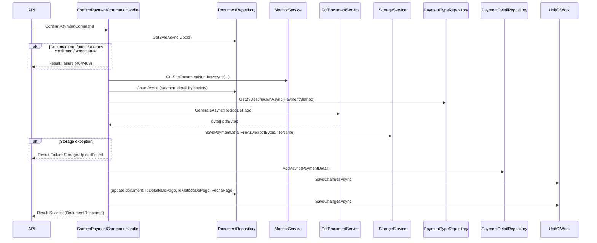

# Plan: Generar y guardar PDF PaymentDetail en ConfirmPaymentCommandHandler

Especificación del flujo que genera el PDF del Recibo de Pago, lo guarda en storage y crea el registro de detalle de pago (`PaymentDetail`) al confirmar el pago de un documento, dentro de `ConfirmPaymentCommandHandler`.

## Estado

**Implementado.** El handler valida el documento, obtiene datos auxiliares (SAP, tipo de pago, número de recibo), genera el PDF con QuestPDF, lo guarda en disco, crea el `PaymentDetail` y actualiza el documento con la referencia al detalle de pago y fecha de pago.

## Endpoint y comando

| Aspecto | Detalle |
|---------|---------|
| **Método y ruta** | `POST /api/v1/Documents/{docId}/confirm-payment` |
| **Autorización** | Policy `RequirePreloadWrite` |
| **Request body** | [ConfirmPaymentRequest](src/GeCom.Following.Preload.Contracts/Preload/Documents/ConfirmPayment/ConfirmPaymentRequest.cs): `PaymentMethod`, `NumeroCheque?`, `Banco?`, `Vencimiento?` |
| **Comando** | [ConfirmPaymentCommand](src/GeCom.Following.Preload.Application/Features/Preload/Documents/ConfirmPayment/ConfirmPaymentCommand.cs): `DocId`, `PaymentMethod`, `NumeroCheque?`, `Banco?`, `Vencimiento?` |
| **Respuesta exitosa** | `200 OK` con [DocumentResponse](src/GeCom.Following.Preload.Contracts/Preload/Documents/DocumentResponse.cs) |

### Validación del comando

- **DocId:** mayor que 0.
- **PaymentMethod:** obligatorio.
- Si **PaymentMethod** es "Cheque o echeq": **NumeroCheque**, **Banco** y **Vencimiento** son obligatorios.

Válida: [ConfirmPaymentCommandValidator](src/GeCom.Following.Preload.Application/Features/Preload/Documents/ConfirmPayment/ConfirmPaymentCommandValidator.cs).

## Dependencias del handler

| Servicio | Uso |
|----------|-----|
| `IDocumentRepository` | Obtener documento por ID; contar documentos con detalle de pago por sociedad (para número de recibo). |
| `IMonitorService` | Obtener número de documento SAP (Orden de Pago) para el recibo. |
| `IPdfDocumentService` | Generar PDF del Recibo de Pago. |
| `IStorageService` | Guardar bytes del PDF en la ruta de payment detail (año/mes + nombre de fichero). |
| `IPaymentDetailRepository` | Crear el registro `PaymentDetail`. |
| `IPaymentTypeRepository` | Resolver tipo de pago por descripción (`PaymentMethod`). |
| `IUnitOfWork` | Persistir cambios (PaymentDetail y actualización del documento). |

## Flujo paso a paso

### 1. Validaciones de negocio

1. **Documento existe:** `GetByIdAsync(request.DocId)`. Si no existe → `404 Document.NotFound`.
2. **Pago no confirmado:** `document.IdDetalleDePago` debe ser `null`. Si ya tiene valor → `409 Document.PaymentAlreadyConfirmed` ("El pago de este documento ya fue confirmado.").
3. **Estado del documento:** `document.State.Codigo` debe ser `"PagadoFin"`. Si no → `409 Document.InvalidStateForConfirmPayment` ("Solo se puede confirmar pago en documentos con estado PAGADO.").

### 2. Datos auxiliares

4. **Número SAP (Orden de Pago):** se llama a `IMonitorService.GetSapDocumentNumberAsync` con datos del documento (NumeroComprobante, ProveedorCuit, SociedadCuit, PuntoDeVenta, Letra del tipo de documento). Resultado opcional; se muestra en el recibo si viene.
5. **Número de recibo:** `CountAsync(d => d.IdDetalleDePago.HasValue && d.SociedadCuit == document.SociedadCuit) + 1` — secuencial por sociedad, formateado a 5 dígitos (ej. "00046").
6. **Tipo de pago:** `IPaymentTypeRepository.GetByDescripcionAsync(request.PaymentMethod)`. Si no existe → `404 PaymentType.NotFound`. Se usa para saber si es transferencia (descripción contiene "Transferencia") y para `IdTipoDePago` en `PaymentDetail`.

### 3. Generar PDF del Recibo de Pago

7. Se construye **ReciboDePagoData** con: número de recibo, fecha emisión (UtcNow), datos del proveedor (CUIT, razón social, opcional nro/dirección/teléfono), cliente (Society.Descripcion), concepto fijo "Pago a Proveedores", importe (MontoBruto), moneda, fecha de alta, EsTransferencia, NroCheque/Banco/Vencimiento (del request), OrdenDePago (SAP).
8. Se crea **PdfDocumentRequest** con `DocumentType = ReciboDePago` y `ReciboDePagoData`.
9. **Generación:** `IPdfDocumentService.GenerateAsync(pdfRequest)` → `byte[] pdfBytes`.

### 4. Guardar PDF en storage

10. **Nombre de fichero:** `Recibo_{document.DocId}_{DateTime.Today:yyyyMMdd}.pdf`.
11. **Guardado:** `IStorageService.SavePaymentDetailFileAsync(pdfBytes, uniqueFileName)`. La implementación escribe en `{PaymentDetailPath}\{año}\{mes}\{uniqueFileName}` y crea carpetas si no existen.
12. Si el guardado lanza excepción → `500 Storage.UploadFailed` con mensaje de la excepción.

### 5. Crear PaymentDetail y actualizar documento

13. Se crea la entidad **PaymentDetail** con: `IdTipoDePago`, `NroCheque` (o ""), `Banco` (o ""), `Vencimiento` (o fechaAlta), `ImporteRecibido` (MontoBruto del documento), `FechaAlta` (DateOnly.Today), `NamePdf` = `uniqueFileName`.
14. **Persistencia:** `IPaymentDetailRepository.AddAsync(paymentDetail)` y `IUnitOfWork.SaveChangesAsync()`.
15. Se actualiza el **documento:** `IdDetalleDePago` = id del PaymentDetail creado, `IdMetodoDePago` = id del tipo de pago, `FechaPago` = DateTime.UtcNow.
16. **Persistencia:** `IUnitOfWork.SaveChangesAsync()` de nuevo.
17. Se mapea el documento a **DocumentResponse** y se devuelve `Result.Success(response)`.

## Códigos de error

| Código | Error | Cuándo |
|--------|-------|--------|
| 404 | Document.NotFound | No existe documento con ese DocId. |
| 404 | PaymentType.NotFound | PaymentMethod no coincide con ningún tipo de pago. |
| 409 | Document.PaymentAlreadyConfirmed | El documento ya tiene IdDetalleDePago. |
| 409 | Document.InvalidStateForConfirmPayment | Estado distinto de PagadoFin. |
| 500 | Storage.UploadFailed | Fallo al escribir el PDF en disco (excepción en SavePaymentDetailFileAsync). |

## Resumen del flujo (diagrama)

## Referencias

- [ConfirmPaymentCommandHandler](src/GeCom.Following.Preload.Application/Features/Preload/Documents/ConfirmPayment/ConfirmPaymentCommandHandler.cs)
- [ConfirmPaymentCommand](src/GeCom.Following.Preload.Application/Features/Preload/Documents/ConfirmPayment/ConfirmPaymentCommand.cs)
- [ConfirmPaymentCommandValidator](src/GeCom.Following.Preload.Application/Features/Preload/Documents/ConfirmPayment/ConfirmPaymentCommandValidator.cs)
- [DocumentsController.ConfirmPaymentAsync](src/GeCom.Following.Preload.WebApi/Controllers/V1/DocumentsController.cs) — `POST {docId}/confirm-payment`
- [ConfirmPaymentRequest](src/GeCom.Following.Preload.Contracts/Preload/Documents/ConfirmPayment/ConfirmPaymentRequest.cs)
- [PaymentDetail](src/GeCom.Following.Preload.Domain/Preloads/PaymentDetails/PaymentDetail.cs)
- [IStorageService.SavePaymentDetailFileAsync](src/GeCom.Following.Preload.Application/Abstractions/Storage/IStorageService.cs)
- [QuestPDF-Integration-Plan](QuestPDF-Integration-Plan.md)
- [Recibo-De-Pago-PDF-Plan](Recibo-De-Pago-PDF-Plan.md)
- [Recibo-De-Pago-PDF-Nombre-Fichero-Plan](Recibo-De-Pago-PDF-Nombre-Fichero-Plan.md)
