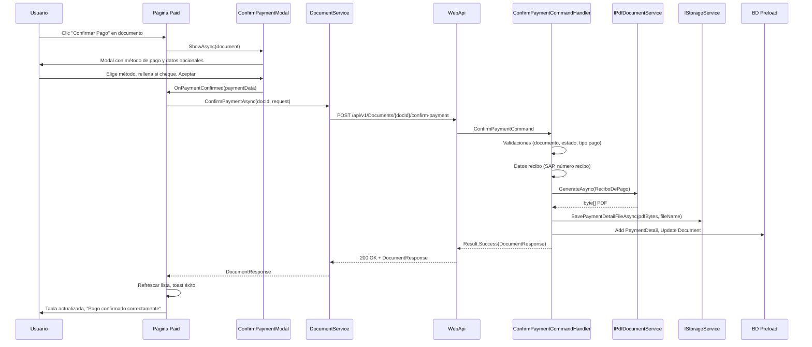

# Plan: Caso de uso Confirmar Pago

Caso de uso completo **Confirmar Pago**: desde la pantalla de documentos pagados en el frontend hasta la generación del PDF del Recibo de Pago, guardado en storage y actualización del documento en backend. Documentación alineada con lo implementado.

## Resumen

El usuario confirma el pago de un documento que está en estado **PAGADO** y que aún no tiene pago confirmado. Indica el método de pago (Transferencia o Cheque/echeq) y, si es cheque, los datos del mismo. El sistema genera el PDF del Recibo de Pago, lo guarda en disco, crea el registro de detalle de pago (`PaymentDetail`) y actualiza el documento. La lista de documentos se refresca y se muestra un mensaje de éxito.

## Flujo de extremo a extremo

---

## 1. Frontend

### 1.1 Página: Documentos Pagados (Paid)

- **Ruta:** `/documents/paid`
- **Archivos:** [Paid.razor](src/GeCom.Following.Preload.WebApp/Components/Pages/Documents/Paid.razor), [Paid.razor.cs](src/GeCom.Following.Preload.WebApp/Components/Pages/Documents/Paid.razor.cs)
- **Comportamiento:**
  - Lista documentos pagados (filtros por fecha y proveedor).
  - Por cada documento con estado **PAGADO** y **sin** `IdDetalleDePago` se muestra el botón verde "Confirmar el Pago" (icono check).
  - Si el documento ya tiene pago confirmado se muestra el badge "Confirmado"; si no, "No-Confirmado".
  - Al hacer clic en "Confirmar el Pago" se llama a `ConfirmarPago(doc)`, que abre el modal de confirmación con el documento seleccionado.

### 1.2 Modal: Confirmar Pago (ConfirmPaymentModal)

- **Archivos:** [ConfirmPaymentModal.razor](src/GeCom.Following.Preload.WebApp/Components/Modals/ConfirmPaymentModal.razor), [ConfirmPaymentModal.razor.cs](src/GeCom.Following.Preload.WebApp/Components/Modals/ConfirmPaymentModal.razor.cs)
- **Contenido del modal:**
  - Resumen del documento: DocId, Proveedor, Monto y Moneda.
  - **Método de pago** (obligatorio): radio "Transferencia" o "Cheque o echeq".
  - Si se elige "Cheque o echeq": campos **Nro de Cheque**, **Banco** y **Vencimiento** (todos obligatorios), con validación en blur y al enviar.
- **Habilitación del botón Aceptar:**
  - Transferencia: siempre habilitado.
  - Cheque o echeq: habilitado solo si Nro de Cheque, Banco y Vencimiento están completos y sin errores de validación.
- **Al hacer Aceptar:**
  - Se cierra el modal (Bootstrap).
  - Se invoca `OnPaymentConfirmed` con un `PaymentConfirmationData` (DocumentId, PaymentMethod, NumeroCheque, Banco, Vencimiento).
  - La página Paid no llama a la API desde el modal; el callback recibe los datos y la página hace la llamada.

### 1.3 Callback en Paid: OnPaymentConfirmed

- Comprueba de nuevo que el documento no tenga ya `IdDetalleDePago` (por si la lista se actualizó). Si ya está confirmado, muestra toast de advertencia y termina.
- Muestra indicador de carga en la tabla.
- Construye [ConfirmPaymentRequest](src/GeCom.Following.Preload.Contracts/Preload/Documents/ConfirmPayment/ConfirmPaymentRequest.cs): `PaymentMethod`, `NumeroCheque`, `Banco`, `Vencimiento`.
- Llama a `DocumentService.ConfirmPaymentAsync(paymentData.DocumentId, request)`.
- Si la llamada es correcta: destruye y vuelve a cargar el DataTable de documentos, recarga la lista con `GetPaidDocuments()`, muestra toast "Pago confirmado correctamente.".
- Si se produce `ApiRequestException`: muestra el mensaje de la API en toast de error.
- Cualquier otra excepción: toast "Error al procesar la confirmación de pago.".

### 1.4 Servicio: DocumentService.ConfirmPaymentAsync

- **Interface:** [IDocumentService.ConfirmPaymentAsync](src/GeCom.Following.Preload.WebApp/Services/IDocumentService.cs)
- **Implementación:** [DocumentService.ConfirmPaymentAsync](src/GeCom.Following.Preload.WebApp/Services/DocumentService.cs)
- **Llamada HTTP:** `POST /api/{version}/Documents/{docId}/confirm-payment` con body `ConfirmPaymentRequest` (JSON). Versión de API desde configuración (p. ej. v1).
- **Respuesta esperada:** `DocumentResponse` (documento actualizado con `IdDetalleDePago`, `IdMetodoDePago`, `FechaPago`).

---

## 2. API (WebApi)

- **Método y ruta:** `POST /api/v1/Documents/{docId}/confirm-payment`
- **Autorización:** Policy `RequirePreloadWrite`
- **Controller:** [DocumentsController.ConfirmPaymentAsync](src/GeCom.Following.Preload.WebApi/Controllers/V1/DocumentsController.cs)
- **Request body:** [ConfirmPaymentRequest](src/GeCom.Following.Preload.Contracts/Preload/Documents/ConfirmPayment/ConfirmPaymentRequest.cs): `PaymentMethod`, `NumeroCheque?`, `Banco?`, `Vencimiento?`
- **Comando:** [ConfirmPaymentCommand](src/GeCom.Following.Preload.Application/Features/Preload/Documents/ConfirmPayment/ConfirmPaymentCommand.cs) con `DocId`, `PaymentMethod`, `NumeroCheque`, `Banco`, `Vencimiento`
- **Respuesta:** `200 OK` con `DocumentResponse`; en error: `400`, `401`, `403`, `404`, `409` o `500` según el resultado del handler (mapeado con `Result.Match(this)`).

---

## 3. Backend (Application + Infrastructure)

### 3.1 Validación del comando

- **Validador:** [ConfirmPaymentCommandValidator](src/GeCom.Following.Preload.Application/Features/Preload/Documents/ConfirmPayment/ConfirmPaymentCommandValidator.cs)
- **Reglas:** DocId > 0; PaymentMethod obligatorio; si PaymentMethod es "Cheque o echeq", NumeroCheque, Banco y Vencimiento obligatorios.

### 3.2 Handler: ConfirmPaymentCommandHandler

- **Archivo:** [ConfirmPaymentCommandHandler](src/GeCom.Following.Preload.Application/Features/Preload/Documents/ConfirmPayment/ConfirmPaymentCommandHandler.cs)
- **Resumen de pasos (implementado):**
  1. Obtener documento; si no existe → 404.
  2. Si ya tiene `IdDetalleDePago` → 409 "El pago de este documento ya fue confirmado.".
  3. Si estado no es "PagadoFin" → 409 "Solo se puede confirmar pago en documentos con estado PAGADO.".
  4. Obtener número SAP (Monitores) y número de recibo (secuencial por sociedad); resolver tipo de pago por descripción (si no existe → 404).
  5. Construir `ReciboDePagoData` y generar PDF con `IPdfDocumentService.GenerateAsync` (ReciboDePago).
  6. Guardar PDF con `IStorageService.SavePaymentDetailFileAsync` (nombre: `Recibo_{DocId}_{yyyyMMdd}.pdf`); si falla → 500.
  7. Crear `PaymentDetail` (IdTipoDePago, NroCheque, Banco, Vencimiento, ImporteRecibido, FechaAlta, NamePdf) y persistir.
  8. Actualizar documento: `IdDetalleDePago`, `IdMetodoDePago`, `FechaPago` y persistir.
  9. Devolver `DocumentResponse` del documento actualizado.

### 3.3 Servicios utilizados

| Servicio | Uso en Confirmar Pago |
|----------|------------------------|
| IDocumentRepository | GetById, CountAsync (número recibo) |
| IMonitorService | GetSapDocumentNumberAsync (Orden de Pago en recibo) |
| IPdfDocumentService | Generar PDF Recibo de Pago |
| IStorageService | SavePaymentDetailFileAsync |
| IPaymentDetailRepository | AddAsync(PaymentDetail) |
| IPaymentTypeRepository | GetByDescripcionAsync(PaymentMethod) |
| IUnitOfWork | SaveChangesAsync |

---

## 4. Códigos de respuesta y mensajes al usuario

| Código HTTP | Error / condición | Comportamiento en frontend |
|-------------|--------------------|----------------------------|
| 200 | Éxito | Lista refrescada, toast "Pago confirmado correctamente." |
| 400 | Validación del comando (FluentValidation) | Mensaje de la API en toast (ApiRequestException) |
| 401 / 403 | No autenticado / sin permiso | Según configuración de HttpClient (redirect o mensaje) |
| 404 | Documento no encontrado o tipo de pago no encontrado | Mensaje de la API en toast |
| 409 | Pago ya confirmado o estado no PAGADO | Mensaje de la API en toast |
| 500 | Error al guardar PDF u otro fallo del servidor | Mensaje de la API o genérico en toast |

---

## 5. Contratos compartidos (Frontend – API)

- **ConfirmPaymentRequest** (body del POST): `PaymentMethod` (string), `NumeroCheque` (string?), `Banco` (string?), `Vencimiento` (DateOnly?).
- **DocumentResponse** (respuesta): incluye entre otros `DocId`, `IdDetalleDePago`, `IdMetodoDePago`, `FechaPago`, datos del documento y del estado.

Los valores de método de pago usados en la UI ("Transferencia", "Cheque o echeq") deben coincidir con las descripciones de los tipos de pago en BD (tabla TipoDePago / PaymentType).

---

## 6. Documentación relacionada

- [ConfirmPayment-PDF-PaymentDetail-Plan](ConfirmPayment-PDF-PaymentDetail-Plan.md) — Flujo detallado del handler (generar PDF, guardar, PaymentDetail).
- [QuestPDF-Integration-Plan](QuestPDF-Integration-Plan.md) — Integración de QuestPDF en la API.
- [Recibo-De-Pago-PDF-Plan](Recibo-De-Pago-PDF-Plan.md) — Diseño del PDF del Recibo de Pago.
- [Recibo-De-Pago-PDF-Nombre-Fichero-Plan](Recibo-De-Pago-PDF-Nombre-Fichero-Plan.md) — Nombre del fichero del recibo.
- [Monitor-Service-Dapper-Monitores-Plan](Monitor-Service-Dapper-Monitores-Plan.md) — Servicio IMonitorService (número SAP).
- [Documents-UseCases](Documents-UseCases.md) — Índice de casos de uso de Documents (incluye referencia a Confirmar Pago si está listado).

---

## 7. Referencias de archivos

**Frontend**

- [Paid.razor](src/GeCom.Following.Preload.WebApp/Components/Pages/Documents/Paid.razor)
- [Paid.razor.cs](src/GeCom.Following.Preload.WebApp/Components/Pages/Documents/Paid.razor.cs)
- [ConfirmPaymentModal.razor](src/GeCom.Following.Preload.WebApp/Components/Modals/ConfirmPaymentModal.razor)
- [ConfirmPaymentModal.razor.cs](src/GeCom.Following.Preload.WebApp/Components/Modals/ConfirmPaymentModal.razor.cs)
- [IDocumentService](src/GeCom.Following.Preload.WebApp/Services/IDocumentService.cs)
- [DocumentService](src/GeCom.Following.Preload.WebApp/Services/DocumentService.cs)

**Contracts**

- [ConfirmPaymentRequest](src/GeCom.Following.Preload.Contracts/Preload/Documents/ConfirmPayment/ConfirmPaymentRequest.cs)

**API**

- [DocumentsController](src/GeCom.Following.Preload.WebApi/Controllers/V1/DocumentsController.cs) — `ConfirmPaymentAsync`

**Application**

- [ConfirmPaymentCommand](src/GeCom.Following.Preload.Application/Features/Preload/Documents/ConfirmPayment/ConfirmPaymentCommand.cs)
- [ConfirmPaymentCommandValidator](src/GeCom.Following.Preload.Application/Features/Preload/Documents/ConfirmPayment/ConfirmPaymentCommandValidator.cs)
- [ConfirmPaymentCommandHandler](src/GeCom.Following.Preload.Application/Features/Preload/Documents/ConfirmPayment/ConfirmPaymentCommandHandler.cs)
