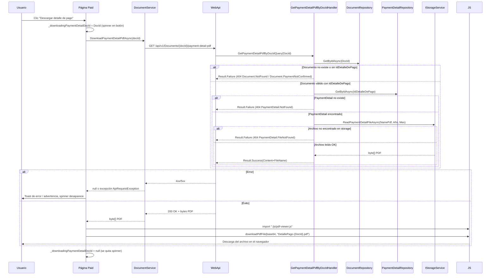

# Plan: Caso de uso Descargar Detalle de Pago

Caso de uso completo **Descargar Detalle de Pago** (PDF de `PaymentDetail`/recibo), iniciado desde la grilla de **Documentos Pagados** en el frontend, resolviendo el `PaymentDetail` asociado en backend y leyendo el PDF desde storage. Documentación alineada con lo implementado.

## Resumen

El usuario, desde la pantalla de **Documentos Pagados**, hace clic en el botón de **descargar detalle de pago** de un documento cuyo pago ya está confirmado (`IdDetalleDePago` tiene valor). El frontend llama a la API pasando el **DocId**, la API resuelve el `PaymentDetail` asociado, lee el PDF desde el folder configurado (`PaymentDetailPath\Año\Mes\NamePdf`) y devuelve el archivo. El frontend muestra un spinner en el botón mientras dura la operación y dispara la descarga del PDF en el navegador; si hay errores, se muestran en un toast.

## Flujo de extremo a extremo



---

## 1. Frontend

### 1.1 Página: Documentos Pagados (`Paid`)

- **Ruta:** `/documents/paid`
- **Archivos:**  
  - [Paid.razor](src/GeCom.Following.Preload.WebApp/Components/Pages/Documents/Paid.razor)  
  - [Paid.razor.cs](src/GeCom.Following.Preload.WebApp/Components/Pages/Documents/Paid.razor.cs)

**Acciones en la primera columna (Conf. de Pago):**

- Botón **Ver detalles** (ojo azul):
  - `btn btn-primary btn-sm p-0 rounded-circle`, `28x28`.
  - `@onclick="() => OpenPaidDocumentDetails(doc.DocId)"` → abre modal de detalles del documento.
- Botones visibles **solo cuando el pago está confirmado**, es decir cuando:
  - `doc.EstadoDescripcion?.ToUpperInvariant() == "PAGADO"` **y**
  - `doc.IdDetalleDePago.HasValue`:
  - **Descargar detalle de pago**:
    - `btn btn-success btn-sm p-0 rounded-circle`, `28x28`.
    - `@onclick="() => DownloadPaymentDetailPdf(doc.DocId)"`.
    - `disabled` si `_downloadingPaymentDetailDocId == doc.DocId`.
    - Muestra:
      - Un **spinner** (`spinner-border spinner-border-sm`) mientras se descarga.
      - El icono `ri-file-download-line` cuando está disponible.
    - `title`: `"Descargando..."` mientras `_downloadingPaymentDetailDocId == doc.DocId`, si no `"Descargar detalle de pago"`.
  - **Descargar comprobante** (fase 2, actualmente placeholder):
    - `btn btn-info btn-sm p-0 rounded-circle`, `28x28`.
    - `@onclick="() => OnDownloadComprobanteClick()"` → actualmente solo muestra toast *"Próximamente: descarga de comprobante."*.
    - Icono `ri-file-text-line` para diferenciarlo del detalle de pago.

Si el documento está **PAGADO** pero aún **no** tiene `IdDetalleDePago` (pago no confirmado), se muestra en su lugar el botón verde **Confirmar el Pago** (`ConfirmarPago(doc)`), tal como se describe en [Confirmar-Pago-UseCase-Plan](Confirmar-Pago-UseCase-Plan.md).

### 1.2 Método `DownloadPaymentDetailPdf` en `Paid.razor.cs`

**Ubicación:** [Paid.razor.cs](src/GeCom.Following.Preload.WebApp/Components/Pages/Documents/Paid.razor.cs)

Comportamiento:

1. Si ya hay una descarga en curso (`_downloadingPaymentDetailDocId.HasValue`), **no hace nada** para evitar clics repetidos.
2. Asigna `_downloadingPaymentDetailDocId = docId` y llama a `StateHasChanged()` para:
   - Deshabilitar el botón de ese documento.
   - Mostrar el spinner en lugar del icono de descarga.
3. Llama a `DocumentService.DownloadPaymentDetailPdfAsync(docId)`:
   - Si devuelve `null` o un array vacío → muestra toast de advertencia:  
     **"No se encontró el archivo de detalle de pago."**
4. Si la llamada tiene éxito:
   - Importa el módulo JS `./js/pdf-viewer.js`:
     ```csharp
     await JsRuntime.InvokeAsync<IJSObjectReference>("import", "./js/pdf-viewer.js");
     ```
   - Convierte el `byte[]` a base64 y llama a la función global `downloadPdfFile`:
     ```csharp
     string base64 = Convert.ToBase64String(pdfBytes);
     await JsRuntime.InvokeVoidAsync("downloadPdfFile", base64, $"DetallePago-{docId}.pdf");
     ```
   - El helper JS crea un `Blob`, un enlace temporal y dispara la descarga en el navegador.
5. Manejo de errores:
   - `ApiRequestException`: se registra en log y se muestra `ex.Message` en un toast de error.
   - Cualquier otra excepción: se registra y se muestra toast genérico  
     **"Error al descargar el detalle de pago."**
6. En `finally`:
   - `_downloadingPaymentDetailDocId = null;`
   - `StateHasChanged();` para reactivar el botón y quitar el spinner.

### 1.3 JS helper `downloadPdfFile`

**Archivo:** [pdf-viewer.js](src/GeCom.Following.Preload.WebApp/wwwroot/js/pdf-viewer.js)

- Función global:
  ```javascript
  window.downloadPdfFile = function(base64String, fileName) { ... }
  ```
- Convierte el base64 a bytes, crea un `Blob` `application/pdf`, genera un `ObjectURL` y dispara la descarga con `<a download>`.
- Maneja errores en consola y muestra `alert` en caso de problema al construir/descargar el archivo.

---

## 2. WebApp – Servicio `DocumentService`

**Interfaces y clases:**

- [IDocumentService](src/GeCom.Following.Preload.WebApp/Services/IDocumentService.cs)
- [DocumentService](src/GeCom.Following.Preload.WebApp/Services/DocumentService.cs)
- [HttpClientService.DownloadFileAsync](src/GeCom.Following.Preload.WebApp/Services/HttpClientService.cs)

### 2.1 `DownloadPaymentDetailPdfAsync`

**Firma:**

```csharp
Task<byte[]?> DownloadPaymentDetailPdfAsync(int docId, CancellationToken cancellationToken = default);
```

Comportamiento:

1. Construye la URL relativa a la API:
   ```csharp
   string apiVersion = _apiSettings.Version;
   Uri requestUri = new($"/api/{apiVersion}/Documents/{docId}/payment-detail-pdf", UriKind.Relative);
   ```
2. Llama a `_httpClientService.DownloadFileAsync(requestUri, cancellationToken)`.
3. Devuelve:
   - `byte[]` con el contenido del PDF si la respuesta es `200 OK`.
   - `null` si la API respondió `404 NotFound`.
   - Lanza `ApiRequestException` para otros códigos de error (`4xx` / `5xx`), o timeout.

### 2.2 `HttpClientService.DownloadFileAsync`

- Si `401 Unauthorized` → lanza `UnauthorizedAccessException`.
- Si `404 NotFound` → devuelve `null`.
- Si otro código no exitoso → extrae mensaje de error de la respuesta (`ExtractErrorMessageAsync`) y lanza `ApiRequestException(statusCode, message)`.
- Si timeout/cancelación → lanza `ApiRequestException` con mensajes específicos de timeout.

---

## 3. API (WebApi)

### 3.1 Endpoint `GET /api/v1/Documents/{docId}/payment-detail-pdf`

**Archivo:** [DocumentsController](src/GeCom.Following.Preload.WebApi/Controllers/V1/DocumentsController.cs)

- **Ruta y método:** `GET api/v1/Documents/{docId}/payment-detail-pdf`
- **Autorización:** Policy `RequirePreloadRead`
- **Acción:** `GetPaymentDetailPdfAsync(int docId, CancellationToken cancellationToken)`
- **Lógica:**
  1. Construye `GetPaymentDetailPdfByDocIdQuery` con el `docId`.
  2. Envía la query via `Mediator.Send`.
  3. Si `result.IsFailure`:
     - Mapea `ErrorType` a:
       - `404 NotFound` (documento no encontrado, pago no confirmado, PaymentDetail inexistente o archivo no encontrado).
       - `400 BadRequest` para validaciones.
       - `401 Unauthorized`, `403 Forbidden` según corresponda.
       - `500 InternalServerError` por defecto.
  4. Si éxito:
     - Obtiene `PaymentDetailPdfResult` (`Content`, `FileName`).
     - Devuelve:
       ```csharp
       return File(pdfResult.Content, "application/pdf", pdfResult.FileName);
       ```

---

## 4. Backend (Application + Infrastructure)

### 4.1 Query `GetPaymentDetailPdfByDocId`

**Archivos:**

- [GetPaymentDetailPdfByDocIdQuery](src/GeCom.Following.Preload.Application/Features/Preload/Documents/GetPaymentDetailPdfByDocId/GetPaymentDetailPdfByDocIdQuery.cs)
- [GetPaymentDetailPdfByDocIdQueryHandler](src/GeCom.Following.Preload.Application/Features/Preload/Documents/GetPaymentDetailPdfByDocId/GetPaymentDetailPdfByDocIdQueryHandler.cs)
- [GetPaymentDetailPdfByDocIdValidator](src/GeCom.Following.Preload.Application/Features/Preload/Documents/GetPaymentDetailPdfByDocId/GetPaymentDetailPdfByDocIdValidator.cs)
- [PaymentDetailPdfResult](src/GeCom.Following.Preload.Application/Features/Preload/Documents/GetPaymentDetailPdfByDocId/PaymentDetailPdfResult.cs)

**Validación:**

- `DocId > 0`.

### 4.2 Handler `GetPaymentDetailPdfByDocIdQueryHandler`

Dependencias:

| Servicio | Uso |
|----------|-----|
| `IDocumentRepository` | Obtener documento por ID (`GetByIdAsync`). |
| `IPaymentDetailRepository` | Obtener `PaymentDetail` por id (`GetByIdAsync`). |
| `IStorageService` | Leer el PDF desde `PaymentDetailPath\Año\Mes\NamePdf`. |

Pasos:

1. **Obtener documento** por `DocId`:
   - Si no existe → `Result.Failure` con error `Document.NotFound` (404).
2. **Verificar pago confirmado**:
   - Si `document.IdDetalleDePago` es `null` → `Result.Failure` con error `Document.PaymentNotConfirmed` (404) – no hay detalle de pago asociado.
3. **Obtener PaymentDetail**:
   - `PaymentDetail? paymentDetail = await _paymentDetailRepository.GetByIdAsync(document.IdDetalleDePago.Value, cancellationToken);`
   - Si `paymentDetail` es `null` → `Result.Failure` con `PaymentDetail.NotFound` (404).
4. **Leer archivo desde storage**:
   - Llama a:
     ```csharp
     byte[] content = await _storageService.ReadPaymentDetailFileAsync(
         paymentDetail.NamePdf,
         paymentDetail.FechaAlta.Year,
         paymentDetail.FechaAlta.Month,
         cancellationToken);
     ```
   - Maneja `FileNotFoundException`:
     - Devuelve `Result.Failure` con error `PaymentDetail.FileNotFound` (404).
5. **Construir resultado**:
   - `new PaymentDetailPdfResult(content, paymentDetail.NamePdf)`
   - Devuelve `Result.Success(...)`.

### 4.3 `IStorageService.ReadPaymentDetailFileAsync`

**Archivos:**

- [IStorageService](src/GeCom.Following.Preload.Application/Abstractions/Storage/IStorageService.cs)
- [StorageService](src/GeCom.Following.Preload.Infrastructure/Storage/StorageService.cs)

Método añadido:

```csharp
Task<byte[]> ReadPaymentDetailFileAsync(string fileName, int year, int month, CancellationToken cancellationToken = default);
```

Implementación:

- Usa `StorageOptions.PaymentDetailPath` como base.
- Asegura que el path termina en `\`.
- Construye la ruta:
  - `fullPath = Path.Combine(PaymentDetailPath, year.ToString(), month.ToString("d2"), fileName);`
- Llama internamente a `ReadFileAsync(fullPath)` con impersonation:
  - Si el archivo no existe → `FileNotFoundException`.

---

## 5. Códigos de respuesta y manejo en frontend

| Capa | Código HTTP | Situación | Comportamiento en frontend |
|------|-------------|-----------|----------------------------|
| API  | 200 | PDF encontrado y leído correctamente | Descarga directa del archivo en el navegador. |
| API  | 400 | `DocId` inválido (validator) | `ApiRequestException` → toast de error con mensaje de la API. |
| API  | 401 / 403 | No autenticado / sin permisos | `ApiRequestException` o `UnauthorizedAccessException` → según manejo general de auth. |
| API  | 404 | Documento no existe, pago no confirmado, PaymentDetail no encontrado o archivo no existe en disco | `DownloadFileAsync` devuelve `null` → toast de advertencia *"No se encontró el archivo de detalle de pago."* |
| API  | 500 | Error al leer del storage u otros errores internos | `ApiRequestException` → toast de error con mensaje de la API. |

Además:

- Mientras la descarga está en curso, `_downloadingPaymentDetailDocId` bloquea clics repetidos y muestra el spinner en el botón de ese documento.

---

## 6. Documentación relacionada

- [Confirmar-Pago-UseCase-Plan](Confirmar-Pago-UseCase-Plan.md) — Caso de uso de confirmación de pago (creación de `PaymentDetail` y generación del PDF de recibo).
- [ConfirmPayment-PDF-PaymentDetail-Plan](ConfirmPayment-PDF-PaymentDetail-Plan.md) — Detalles de generación/guardado del PDF del recibo.
- [Recibo-De-Pago-PDF-Nombre-Fichero-Plan](Recibo-De-Pago-PDF-Nombre-Fichero-Plan.md) — Convención de nombres del PDF.

---

## 7. Referencias de archivos

**Frontend**

- [Paid.razor](src/GeCom.Following.Preload.WebApp/Components/Pages/Documents/Paid.razor)
- [Paid.razor.cs](src/GeCom.Following.Preload.WebApp/Components/Pages/Documents/Paid.razor.cs)
- [IDocumentService](src/GeCom.Following.Preload.WebApp/Services/IDocumentService.cs)
- [DocumentService](src/GeCom.Following.Preload.WebApp/Services/DocumentService.cs)
- [HttpClientService](src/GeCom.Following.Preload.WebApp/Services/HttpClientService.cs)
- [pdf-viewer.js](src/GeCom.Following.Preload.WebApp/wwwroot/js/pdf-viewer.js)

**API**

- [DocumentsController](src/GeCom.Following.Preload.WebApi/Controllers/V1/DocumentsController.cs) — `GetPaymentDetailPdfAsync`

**Application**

- [GetPaymentDetailPdfByDocIdQuery](src/GeCom.Following.Preload.Application/Features/Preload/Documents/GetPaymentDetailPdfByDocId/GetPaymentDetailPdfByDocIdQuery.cs)
- [GetPaymentDetailPdfByDocIdQueryHandler](src/GeCom.Following.Preload.Application/Features/Preload/Documents/GetPaymentDetailPdfByDocId/GetPaymentDetailPdfByDocIdQueryHandler.cs)
- [GetPaymentDetailPdfByDocIdValidator](src/GeCom.Following.Preload.Application/Features/Preload/Documents/GetPaymentDetailPdfByDocId/GetPaymentDetailPdfByDocIdValidator.cs)
- [PaymentDetailPdfResult](src/GeCom.Following.Preload.Application/Features/Preload/Documents/GetPaymentDetailPdfByDocId/PaymentDetailPdfResult.cs)
- [IStorageService](src/GeCom.Following.Preload.Application/Abstractions/Storage/IStorageService.cs)

**Domain / Infra**

- [PaymentDetail](src/GeCom.Following.Preload.Domain/Preloads/PaymentDetails/PaymentDetail.cs)
- [PaymentDetailRepository](src/GeCom.Following.Preload.Infrastructure/Persistence/Repositories/Preload/PaymentDetailRepository.cs)
- [StorageService](src/GeCom.Following.Preload.Infrastructure/Storage/StorageService.cs)

