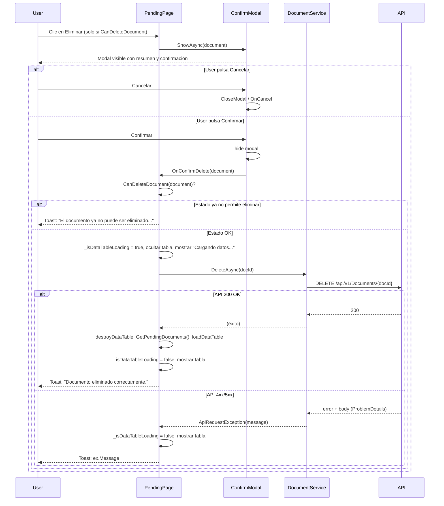

# Caso de Uso en el Frontend: Eliminación lógica de documento

Este documento describe la implementación en la WebApp (Blazor) del caso de uso **eliminación lógica de documento**: flujo de usuario, componentes, servicio, validaciones y mensajes.

## Tabla de Contenidos

- [Resumen](#resumen)
- [Flujo de usuario](#flujo-de-usuario)
- [Indicador de carga al confirmar](#indicador-de-carga-al-confirmar)
- [Componentes y archivos](#componentes-y-archivos)
- [Validación por estado en el frontend](#validación-por-estado-en-el-frontend)
- [Servicio y API](#servicio-y-api)
- [Mensajes al usuario](#mensajes-al-usuario)
- [Diagrama de flujo](#diagrama-de-flujo)

---

## Resumen

- **Dónde:** Página **Documentos pendientes** (`/documents/pending`).
- **Acción:** El usuario puede eliminar lógicamente un documento (marcar como dado de baja) mediante un botón **Eliminar** que solo se muestra cuando el documento está en un estado permitido y el usuario tiene rol adecuado.
- **Confirmación:** Al pulsar Eliminar se abre un **modal** que pide confirmación. Al confirmar, se revalida el estado en el frontend y se llama a la API `DELETE /api/v1/Documents/{docId}`. En éxito se refresca la lista y se muestra un toast; en error se muestra el mensaje devuelto por la API.

---

## Flujo de usuario

1. El usuario está en **Documentos pendientes** y ve la tabla de documentos.
2. Solo para documentos con **EstadoId 1** (Pendiente Precarga) o **EstadoId 2** (Precarga Pendiente) y con rol con permiso de escritura, se muestra el botón **Eliminar** (icono de papelera).
3. El usuario pulsa **Eliminar** → se abre el **modal de confirmación** con el resumen del documento y el texto: *"¿Está seguro de eliminar este documento? Esta acción marcará el documento como dado de baja."*
4. **Cancelar** → se cierra el modal y no se hace ninguna llamada a la API.
5. **Confirmar** → se cierra el modal y el código del padre:
   - Revalida que el documento siga en estado permitido (EstadoId 1 o 2). Si no, muestra toast de advertencia y termina.
   - Activa el **estado de carga** de la grilla (`_isDataTableLoading = true`): se muestra "Cargando datos..." y se oculta la tabla (no se puede volver a pulsar Eliminar).
   - Llama a `DocumentService.DeleteAsync(docId)` (DELETE a la API).
   - Refresca la grilla: destroy DataTable, `GetPendingDocuments()`, load DataTable.
   - Si la API responde éxito: toast de éxito y la grilla se muestra de nuevo con los datos actualizados.
   - Si la API responde error (404, 409, etc.): toast con el mensaje devuelto por la API (p. ej. *"No se puede eliminar un documento en estado X"*).
   - En todos los casos se desactiva el estado de carga (`_isDataTableLoading = false`) para volver a mostrar la tabla.

---

## Indicador de carga al confirmar

Para evitar que el usuario quede sin feedback tras cerrar el modal y que pueda volver a pulsar Eliminar sobre el mismo documento mientras se procesa la petición:

- Al confirmar, **antes** de llamar a la API, se pone `_isDataTableLoading = true` y se fuerza un re-render (`StateHasChanged()`).
- En la vista, cuando `_isDataTableLoading` es true solo se muestra el mensaje **"Cargando datos..."** (spinner); las pestañas y la tabla de documentos pendientes se ocultan (`@if (!_isDataTableLoading)`), por lo que los botones Eliminar, Editar y Ver no son accesibles.
- Tras la llamada a la API y el refresco de la grilla (destroy DataTable → GetPendingDocuments → load DataTable), en un bloque `finally` se pone `_isDataTableLoading = false` tanto si la eliminación fue correcta como si hubo error, de modo que la tabla vuelve a mostrarse.

---

## Componentes y archivos

| Archivo | Descripción |
|--------|-------------|
| `Components/Pages/Documents/Pending.razor` | Página de documentos pendientes. Contiene el botón Eliminar y el componente del modal. Cuando `_isDataTableLoading` es true muestra solo "Cargando datos..." y oculta la tabla (evita doble clic en Eliminar). |
| `Components/Pages/Documents/Pending.razor.cs` | Lógica: `CanDeleteDocument`, `DeleteDocument` (abre modal), `OnConfirmDeleteDocument` (revalidación, activar/desactivar `_isDataTableLoading`, llamada API, destroy/load DataTable, toasts, refresco). |
| `Components/Modals/ConfirmDeleteDocumentModal.razor` | Modal Bootstrap: cabecera "Eliminar documento", resumen del documento, texto de confirmación, botones Cancelar y Confirmar. |
| `Components/Modals/ConfirmDeleteDocumentModal.razor.cs` | `ShowAsync(DocumentResponse)`, `OnConfirmDelete` / `OnCancel`, cierre del modal y callback al padre. |
| `Services/IDocumentService.cs` | Contrato: `Task DeleteAsync(int docId, CancellationToken cancellationToken = default)`. |
| `Services/DocumentService.cs` | Implementación: construye `DELETE /api/{version}/Documents/{docId}` y llama a `IHttpClientService.DeleteAsync`. |
| `Services/HttpClientService.cs` | `DeleteAsync(Uri)`: en respuestas no exitosas lee el cuerpo (ProblemDetails) y lanza `ApiRequestException(StatusCode, message)` para que el frontend muestre el mensaje del API. |

El modal **no** llama a la API; solo pide confirmación y notifica al padre mediante `EventCallback<DocumentResponse> OnConfirmDelete`. La llamada a la API la realiza la página `Pending` en `OnConfirmDeleteDocument`.

---

## Validación por estado en el frontend

- **Objetivo:** Mostrar el botón Eliminar solo cuando el documento puede ser eliminado por la API (evitar clics que acaben en 409).
- **Criterio:** `document.EstadoId is 1 or 2` (PendPrecarga y Precargado), alineado con la regla del backend.
- **Rol:** Además el usuario debe tener permiso de escritura (`_hasSupportedRole`), que ya se usa para mostrar/ocultar edición y eliminación.

**Método en Pending.razor.cs:**

```csharp
private bool CanDeleteDocument(DocumentResponse document)
{
    bool hasCorrectStatus = document.EstadoId is 1 or 2;
    bool canDelete = hasCorrectStatus && _hasSupportedRole;
    return canDelete;
}
```

- La **revalidación** al confirmar (en `OnConfirmDeleteDocument`) usa el mismo `CanDeleteDocument` por si el estado cambió entre abrir el modal y pulsar Confirmar (p. ej. otra pestaña o usuario). Si ya no se puede eliminar, se muestra un toast de advertencia y no se llama a la API.

---

## Servicio y API

- **Método del servicio:** `IDocumentService.DeleteAsync(int docId, CancellationToken cancellationToken = default)`.
- **HTTP:** `DELETE /api/v1/Documents/{docId}` (versión según configuración).
- **Respuestas esperadas:**
  - **200 OK:** Eliminación lógica correcta (el backend devuelve el documento con `FechaBaja` actualizada; el frontend no usa el cuerpo, solo refresca la lista).
  - **400:** Parámetros inválidos (p. ej. DocId &lt;= 0).
  - **401 / 403:** No autenticado o sin permiso.
  - **404:** Documento no encontrado.
  - **409:** Documento ya dado de baja o documento en un estado que no permite eliminación. El mensaje del API (p. ej. *"No se puede eliminar un documento en estado X"*) se muestra en el toast gracias a `ApiRequestException`.
  - **500:** Error del servidor.

El `HttpClientService.DeleteAsync` ya no usa `EnsureSuccessStatusCode()`; ante respuestas no exitosas lee el cuerpo (ProblemDetails) y lanza `ApiRequestException(response.StatusCode, errorMessage)` para que la página pueda hacer `catch (ApiRequestException ex)` y mostrar `ex.Message` en el toast.

---

## Mensajes al usuario

| Situación | Mensaje (toast) |
|----------|------------------|
| Eliminación exitosa | "Documento eliminado correctamente." (éxito) |
| Estado cambió antes de confirmar | "El documento ya no puede ser eliminado. El estado ha cambiado." (advertencia) |
| Error devuelto por la API (404, 409, etc.) | `ex.Message` del API (ProblemDetails.detail) (error) |
| Error inesperado (excepción no ApiRequestException) | "Error al intentar eliminar el documento." (error) |

Texto del modal: *"¿Está seguro de eliminar este documento? Esta acción marcará el documento como dado de baja."*

---

## Diagrama de flujo



---

## Referencia al caso de uso en la API

La documentación del endpoint y reglas de negocio (estados permitidos, códigos de respuesta, etc.) está en [Documents-UseCases.md](Documents-UseCases.md), sección **Commands (Comandos) → DeleteDocument**.
