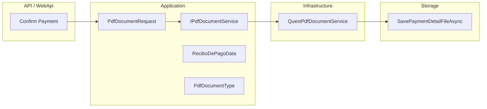

# Plan: Integrar QuestPDF en la API

Generación de documentos PDF en la API mediante la librería QuestPDF, con abstracción en la capa Application e implementación en Infrastructure.

## Estado

La integración está **implementada** (estado actual). Componentes principales:

- **Paquete:** QuestPDF 2024.12.0 definido en `Directory.Packages.props`.
- **Application:** contrato `IPdfDocumentService`, DTOs `PdfDocumentRequest`, `ReciboDePagoData`, enum `PdfDocumentType`.
- **Infrastructure:** `QuestPdfDocumentService` (licencia Community), documentos Placeholder y Recibo de Pago.
- **DI:** registro `AddScoped<IPdfDocumentService, QuestPdfDocumentService>()` en `InfrastructureDependencyInjection`.
- **Uso:** `ConfirmPaymentCommandHandler` genera el PDF de Recibo de Pago, lo guarda en storage y crea el `PaymentDetail`.

## Arquitectura

- **Application:** contrato `IPdfDocumentService`, DTOs `PdfDocumentRequest`, `ReciboDePagoData`, enum `PdfDocumentType`.
- **Infrastructure:** `QuestPdfDocumentService` (QuestPDF), registro en DI.
- **Flujo de uso:** Confirmación de pago → generación Recibo de Pago → guardado en storage → creación de `PaymentDetail` y actualización del documento.

## Tipos de documento soportados

| Tipo             | Descripción |
|------------------|-------------|
| **Placeholder**  | Documento simple con título y contenido genérico (A4, header, footer con número de página). |
| **ReciboDePago** | Recibo de pago con datos de proveedor, cliente, importe, concepto, transferencia/cheque, número de recibo, orden de pago, etc. |
| **ComprobantePago** | Reservado para uso futuro. |

## Dependencias y licencia

- **Paquete:** QuestPDF 2024.12.0 (versión centralizada en [Directory.Packages.props](Directory.Packages.props)).
- **Licencia:** `LicenseType.Community`, configurada en el constructor estático de [QuestPdfDocumentService](src/GeCom.Following.Preload.Infrastructure/Pdf/QuestPdfDocumentService.cs).

## Flujo de uso actual (Confirmación de pago)

1. **Disparador:** comando Confirm Payment (endpoint que invoca `ConfirmPaymentCommand`).
2. **Validaciones:** documento existe, estado "PagadoFin", pago no confirmado previamente.
3. **Datos del recibo:** se construye `ReciboDePagoData` desde el documento, tipo de pago (transferencia/cheque), número SAP si aplica, y número de recibo (secuencial por sociedad).
4. **Generación PDF:** `IPdfDocumentService.GenerateAsync(pdfRequest)` → `byte[]` del PDF.
5. **Guardado:** `IStorageService.SavePaymentDetailFileAsync(pdfBytes, uniqueFileName)` con nombre `Recibo_{DocId}_{yyyyMMdd}.pdf`.
6. **Persistencia:** creación de `PaymentDetail` (incluye `NamePdf`) y actualización del documento (`IdDetalleDePago`, `IdMetodoDePago`, `FechaPago`).

## Posibles extensiones

- Implementar y usar el tipo `ComprobantePago` si se requiere otro formato de comprobante.
- Añadir un endpoint para generar/descargar solo el PDF del recibo (por ejemplo "descargar recibo" por `IdDetalleDePago` o por documento).

## Actualizaciones futuras del documento

Si se añaden nuevos tipos de documento, nuevos endpoints o se cambia la versión de QuestPDF, actualizar este mismo `.md` en las secciones: Estado, Tipos de documento, Dependencias, Flujo o Referencias.

## Referencias

- [Directory.Packages.props](Directory.Packages.props) — versión QuestPDF
- [IPdfDocumentService](src/GeCom.Following.Preload.Application/Abstractions/Pdf/IPdfDocumentService.cs)
- [PdfDocumentRequest](src/GeCom.Following.Preload.Application/Abstractions/Pdf/PdfDocumentRequest.cs)
- [PdfDocumentType](src/GeCom.Following.Preload.Application/Abstractions/Pdf/PdfDocumentType.cs)
- [ReciboDePagoData](src/GeCom.Following.Preload.Application/Abstractions/Pdf/ReciboDePagoData.cs)
- [QuestPdfDocumentService](src/GeCom.Following.Preload.Infrastructure/Pdf/QuestPdfDocumentService.cs)
- [InfrastructureDependencyInjection](src/GeCom.Following.Preload.Infrastructure/InfrastructureDependencyInjection.cs)
- [ConfirmPaymentCommandHandler](src/GeCom.Following.Preload.Application/Features/Preload/Documents/ConfirmPayment/ConfirmPaymentCommandHandler.cs)
