# Dashboard - Documentos en Proceso

## Objetivo

Detallar cómo se calcula el total de documentos en proceso en el Dashboard, desde el handler de aplicación hasta la capa de persistencia, incluyendo filtros por estado, fechas y CUIT según el rol del usuario.

## Descripción de la métrica

En el Dashboard, el valor mostrado como **"Documentos en Progreso"** corresponde a **TotalProcessedDocuments** en `DashboardResponse`.  
**"Documentos en proceso"** son documentos que cumplen:

- `FechaBaja == null` (no dados de baja)
- `FechaEmisionComprobante.HasValue` (tienen fecha de emisión)
- `EstadoId != null`
- `EstadoId` no está en {1, 2, 5, 16} (no pendientes ni pagados)

Es decir: documentos activos, emitidos, con estado definido, que no están pendientes ni pagados.

## Pasos del plan

1. **Identificar la métrica en el DTO y en el Dashboard**  
   En `DashboardResponse` la propiedad es `TotalProcessedDocuments`. En la vista se muestra como "Documentos en Progreso".

2. **Localizar y analizar el cálculo en el handler**  
   En `GetDashboardQueryHandler`, el bloque que calcula `totalProcessedDocuments` (líneas ~211-245) construye el predicado LINQ y llama a `_documentRepository.CountAsync(predicate)`.

3. **Desglosar la lógica por rol**  
   - **Administrator/ReadOnly**: sin filtro de CUIT.  
   - **Providers**: filtro por `ProveedorCuit` del claim.  
   - **Societies**: uso de `BuildSocietyCuitProcessedDocumentPredicate` para una expresión OR sobre múltiples `SociedadCuit`.

4. **Seguir la cadena hasta la capa de datos**  
   `DocumentRepository` hereda de `GenericRepository<Document>`. El método `CountAsync(predicate)` en `GenericRepository` ejecuta `_dbSet.CountAsync(predicate)`; EF Core traduce a SQL sobre la tabla `Documentos`.

5. **Derivar la query SQL equivalente**  
   Condiciones: `FechaBaja IS NULL`, `FechaEmisionComprobante IS NOT NULL`, `EstadoId IS NOT NULL AND EstadoId NOT IN (1,2,5,16)`, más filtro de `ProveedorCuit` o `SociedadCuit` según el rol.

## Diagrama de flujo

```mermaid
flowchart LR
  dashboardPage[DashboardRazor] --> dashboardService[DashboardService]
  dashboardService --> apiEndpoint[DashboardController_Get]
  apiEndpoint --> queryHandler[GetDashboardQueryHandler]
  queryHandler --> processedCalc[totalProcessedDocuments]
  processedCalc --> documentRepo[DocumentRepository_CountAsync]
  documentRepo --> database[Database_Documentos]
```



## Resultados

### Resumen funcional

El **total de documentos en proceso** es el conteo de documentos que:

- No están dados de baja
- Tienen fecha de emisión
- Tienen un estado que no es pendiente (1, 2, 5) ni pagado (16)

El conteo se restringe por proveedor o sociedad según el rol del usuario.

### Predicados LINQ clave

**Administrador / ReadOnly:**

```csharp
d => d.FechaBaja == null
    && d.FechaEmisionComprobante.HasValue
    && d.EstadoId != null
    && d.EstadoId != 1
    && d.EstadoId != 2
    && d.EstadoId != 5
    && d.EstadoId != 16
```

**Providers:**

```csharp
d => d.FechaBaja == null
    && d.FechaEmisionComprobante.HasValue
    && d.EstadoId != null
    && d.EstadoId != 1
    && d.EstadoId != 2
    && d.EstadoId != 5
    && d.EstadoId != 16
    && d.ProveedorCuit == capturedProviderCuit
```

**Societies** (construido con `BuildSocietyCuitProcessedDocumentPredicate`):

```csharp
d => d.FechaBaja == null
    && d.FechaEmisionComprobante.HasValue
    && d.EstadoId != null
    && d.EstadoId != 1
    && d.EstadoId != 2
    && d.EstadoId != 5
    && d.EstadoId != 16
    && d.SociedadCuit != null
    && (d.SociedadCuit == cuit1 || d.SociedadCuit == cuit2 || ...)
```

### SQL equivalente aproximado

```sql
SELECT COUNT(*)
FROM Documentos d
WHERE d.FechaBaja IS NULL
  AND d.FechaEmisionComprobante IS NOT NULL
  AND d.EstadoId IS NOT NULL
  AND d.EstadoId NOT IN (1, 2, 5, 16)
  -- Providers: AND d.ProveedorCuit = @providerCuit
  -- Societies: AND d.SociedadCuit IN (@cuit1, @cuit2, ...)
  -- Admin/ReadOnly: sin filtro adicional de CUIT
```

### Rutas de archivos y métodos relevantes

| Ubicación | Descripción |
|-----------|-------------|
| `src/GeCom.Following.Preload.WebApp/Components/Pages/Dashboard.razor` | Muestra "Documentos en Progreso" (aprox. línea 102) |
| `src/GeCom.Following.Preload.Application/Features/Preload/Dashboard/GetDashboard/GetDashboardQueryHandler.cs` | Cálculo de `totalProcessedDocuments` (líneas ~211-245); método `BuildSocietyCuitProcessedDocumentPredicate` (líneas ~462-505) |
| `src/GeCom.Following.Preload.Infrastructure/Persistence/Repositories/GenericRepository.cs` | Método `CountAsync` (líneas ~74-79) sobre `DbSet<Document>` |
| `src/GeCom.Following.Preload.Contracts/Preload/Dashboard/DashboardResponse.cs` | Propiedad `TotalProcessedDocuments` |

### Notas técnicas

- Se usa `CountAsync` para no materializar todos los documentos.
- Para Societies se construye el predicado dinámicamente (Expression Trees) para evitar problemas con OPENJSON en SQL Server.
- **Estados excluidos**: 1, 2, 5 (pendientes), 16 (pagado). **Incluidos**: cualquier otro estado definido (p. ej. en trámite, aprobado, rechazado, etc.).
