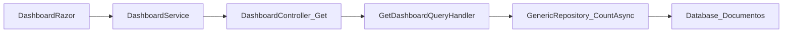

# Dashboard - Documentos Pendientes

## Objetivo

Identificar la consulta final que ejecuta el backend (API) para calcular el total de documentos pendientes mostrado en la página Dashboard, describiendo el flujo completo desde la página hasta la capa de datos.

## Descripción de la métrica

La métrica **Documentos Pendientes** cuenta documentos que cumplen:

- `FechaBaja == null` (no eliminados)
- `FechaEmisionComprobante.HasValue` (tienen fecha de emisión)
- `EstadoId IN (1, 2, 5)` (estados pendientes)

El filtrado por CUIT (proveedor o sociedad) depende del rol del usuario.

## Pasos del plan

1. **Revisar Dashboard.razor y code-behind**  
   El componente obtiene el total vía `DashboardService.GetDashboardAsync()`; la respuesta incluye `TotalPendingsDocuments` (o equivalente en el DTO).

2. **Localizar el cliente de API y el endpoint**  
   `DashboardService` llama a `GET /api/v1/Dashboard` y recibe un `DashboardResponse` con el total de documentos pendientes.

3. **Analizar el controlador y el handler**  
   `DashboardController` crea `GetDashboardQuery` (roles, email, CUIT) y la envía al handler mediante MediatR.  
   `GetDashboardQueryHandler` construye el predicado LINQ para documentos pendientes y llama a `_documentRepository.CountAsync(predicate)`.

4. **Seguir hasta la capa de datos**  
   `GenericRepository.CountAsync` ejecuta `_dbSet.CountAsync(predicate)` sobre `DbSet<Document>` (tabla `Documentos`). EF Core traduce a `SELECT COUNT(*)`.

5. **Resumir flujo y query final**  
   Dashboard.razor → DashboardService → GET /api/v1/Dashboard → GetDashboardQueryHandler → DocumentRepository.CountAsync → base de datos.

## Diagrama de flujo



## Resultados

### Resumen funcional

El total de documentos pendientes es el **conteo de documentos** en la tabla `Documentos` que:

- No están dados de baja (`FechaBaja IS NULL`)
- Tienen fecha de emisión
- Tienen estado pendiente (`EstadoId IN (1, 2, 5)`)

Además, según el rol:

- **Administrator / ReadOnly**: sin filtro por CUIT
- **Providers**: solo documentos con `ProveedorCuit` igual al CUIT del proveedor del usuario
- **Societies**: solo documentos cuyo `SociedadCuit` está en el conjunto de sociedades asignadas al usuario

### Predicados LINQ clave

**Administrador / ReadOnly:**

```csharp
d => d.FechaBaja == null
    && d.FechaEmisionComprobante.HasValue
    && (d.EstadoId == 1 || d.EstadoId == 2 || d.EstadoId == 5)
```

**Providers:**

```csharp
d => d.FechaBaja == null
    && d.FechaEmisionComprobante.HasValue
    && d.ProveedorCuit == capturedProviderCuit
    && (d.EstadoId == 1 || d.EstadoId == 2 || d.EstadoId == 5)
```

**Societies** (construido con `BuildSocietyCuitPendingDocumentPredicate`):

```csharp
d => d.FechaBaja == null
    && d.FechaEmisionComprobante.HasValue
    && d.SociedadCuit != null
    && (d.SociedadCuit == cuit1 || d.SociedadCuit == cuit2 || ...)
    && (d.EstadoId == 1 || d.EstadoId == 2 || d.EstadoId == 5)
```

### SQL equivalente aproximado

```sql
SELECT COUNT(*)
FROM Documentos
WHERE FechaBaja IS NULL
  AND FechaEmisionComprobante IS NOT NULL
  AND EstadoId IN (1, 2, 5)
  -- Providers: AND ProveedorCuit = @providerCuit
  -- Societies: AND SociedadCuit IN (@societyCuit1, @societyCuit2, ...)
```

### Rutas de archivos y métodos relevantes

| Ubicación | Descripción |
|-----------|-------------|
| `src/GeCom.Following.Preload.WebApp/Components/Pages/Dashboard.razor` | Vista que muestra el total de documentos pendientes |
| `src/GeCom.Following.Preload.WebApp/Services/DashboardService.cs` | Llama a `GET /api/v1/Dashboard` |
| `src/GeCom.Following.Preload.Api/Controllers/DashboardController.cs` | Endpoint `GET /api/v1/Dashboard`, envía `GetDashboardQuery` |
| `src/GeCom.Following.Preload.Application/Features/Preload/Dashboard/GetDashboard/GetDashboardQueryHandler.cs` | Construye predicado y llama a `_documentRepository.CountAsync`; método `BuildSocietyCuitPendingDocumentPredicate` (líneas ~313-355) |
| `src/GeCom.Following.Preload.Infrastructure/Persistence/Repositories/GenericRepository.cs` | Método `CountAsync` (líneas ~74-79): `_dbSet.CountAsync(predicate)` sobre `Documentos` |
| `src/GeCom.Following.Preload.Contracts/Preload/Dashboard/DashboardResponse.cs` | Propiedad que expone el total (p. ej. `TotalPendingsDocuments`) |

### Notas técnicas

- Se usa `CountAsync` para no materializar todos los documentos; EF Core traduce el predicado a SQL.
- Para el rol Societies se construye el predicado dinámicamente (Expression Trees) para evitar problemas con OPENJSON en SQL Server.
- La tabla de entidad es `Document` mapeada a `Documentos` en base de datos.
