# Dashboard - Órdenes de Compra

## Objetivo

Responder cómo se calculan las órdenes de compra para el Dashboard, describiendo el flujo desde el frontend hasta la capa de infraestructura y detallando los filtros aplicados según el rol del usuario.

## Descripción de la métrica

La métrica **TotalPurchaseOrders** cuenta el número de **órdenes de compra SAP** (`SapPurchaseOrder`) visibles para el usuario. No se aplican filtros por estado, fecha ni soft delete en la tabla de órdenes; solo el filtrado por rol (CUIT de proveedor o códigos de sociedad FI).

## Pasos del plan

1. **Revisar el flujo del Dashboard**  
   `Dashboard.razor` muestra `TotalPurchaseOrders` del `DashboardResponse`. El handler `GetDashboardQueryHandler` es el responsable de calcular esta métrica.

2. **Identificar la lógica de cálculo en el handler**  
   El método `CountSapPurchaseOrdersAsync` distingue el comportamiento según el rol: Administrator/ReadOnly, Providers, Societies.

3. **Seguir las llamadas a repositorios**  
   Se usa `SapPurchaseOrderRepository`: `GetAllAsync` (Admin/ReadOnly), `GetByProviderAccountNumberAsync` (Providers), `GetBySociedadFiCodesAsync` (Societies). Para Admin, puede usarse `GenericRepository.GetAllAsync`.

4. **Extraer filtros por rol**  
   - **Administrator/ReadOnly**: todas las órdenes (sin filtro de CUIT).  
   - **Providers**: se obtiene `AccountNumber` desde `SapAccount` por CUIT de proveedor (`customertypecode = 11`); se filtran órdenes por `Proveedor == AccountNumber`.  
   - **Societies**: se obtienen las sociedades asignadas al usuario; se traduce cada CUIT a su código FI (`customertypecode = 3`); se filtran órdenes por `Codigosociedadfi` en ese conjunto.

5. **Derivar la query final**  
   Forma general de la consulta por rol y mención de que no se aplican filtros por estado, fecha ni soft delete para órdenes de compra en el Dashboard.

## Diagrama de flujo

```mermaid
flowchart LR
  dashboardPage[DashboardRazor] --> dashboardService[DashboardService]
  dashboardService --> apiEndpoint[DashboardController_Get]
  apiEndpoint --> queryHandler[GetDashboardQueryHandler]
  queryHandler --> countMethod[CountSapPurchaseOrdersAsync]
  countMethod --> sapRepo[SapPurchaseOrderRepository]
  sapRepo --> database[Database_ordenes]
```



## Resultados

### Resumen funcional

El Dashboard calcula **TotalPurchaseOrders** como el número de registros de la tabla de órdenes de compra SAP visibles para el usuario según su rol:

- **Administrator/ReadOnly**: todas las órdenes.
- **Providers**: solo órdenes donde `Proveedor` coincide con el `AccountNumber` SAP del proveedor (obtenido por CUIT).
- **Societies**: solo órdenes donde `Codigosociedadfi` está en el conjunto de códigos FI de las sociedades asignadas al usuario.

No se filtran por estado, fecha ni campo de borrado lógico.

### Predicados / consultas LINQ clave

**Administrator / ReadOnly:**

```csharp
var purchaseOrders = await _sapPurchaseOrderRepository.GetAllAsync(cancellationToken);
var total = purchaseOrders.Count;
```

**Providers:**

```csharp
SapAccount? providerAccount = await _sapAccountRepository.FirstOrDefaultAsync(
    a => a.NewCuit == providerCuit && a.Customertypecode == 11,
    cancellationToken);

var purchaseOrders = await _sapPurchaseOrderRepository.GetByProviderAccountNumberAsync(
    providerAccount.Accountnumber,
    cancellationToken);
```

En el repositorio, `GetByProviderAccountNumberAsync` aplica:

```csharp
.Where(po => po.Proveedor == providerAccountNumber)
```

**Societies:**

- Se obtienen asignaciones con `_userSocietyAssignmentRepository.GetByEmailAsync`.
- Para cada CUIT de sociedad se busca `SapAccount` con `NewCuit == societyCuit` y `Customertypecode == 3`.
- Se llama a `GetBySociedadFiCodesAsync(sociedadFiCodes, cancellationToken)`, que filtra por `Codigosociedadfi` (expresión OR explícita para evitar OPENJSON).

### SQL equivalente aproximado

**Administrator / ReadOnly:**

```sql
SELECT COUNT(*) FROM ordenes;
```

**Providers:**

```sql
-- Obtener AccountNumber del proveedor
SELECT Accountnumber FROM SapAccounts
WHERE NewCuit = @providerCuit AND Customertypecode = 11;

SELECT COUNT(*) FROM ordenes WHERE Proveedor = @providerAccountNumber;
```

**Societies:**

```sql
SELECT COUNT(*) FROM ordenes
WHERE Codigosociedadfi IS NOT NULL
  AND (Codigosociedadfi = @code1 OR Codigosociedadfi = @code2 OR ...);
```

### Rutas de archivos y métodos relevantes

| Ubicación | Descripción |
|-----------|-------------|
| `src/GeCom.Following.Preload.WebApp/Components/Pages/Dashboard.razor` | Muestra `_totalPurchaseOrders` |
| `src/GeCom.Following.Preload.Application/Features/Preload/Dashboard/GetDashboard/GetDashboardQueryHandler.cs` | Método `CountSapPurchaseOrdersAsync` (líneas ~515-624) |
| `src/GeCom.Following.Preload.Infrastructure/Persistence/Repositories/Spd_Sap/SapPurchaseOrderRepository.cs` | `GetByProviderAccountNumberAsync`, `GetBySociedadFiCodesAsync` |
| `src/GeCom.Following.Preload.Infrastructure/Persistence/Repositories/GenericRepository.cs` | `GetAllAsync` (usado para Admin/ReadOnly) |
| `src/GeCom.Following.Preload.Contracts/Preload/Dashboard/DashboardResponse.cs` | Propiedad `TotalPurchaseOrders` |

### Notas técnicas

- No hay filtros por estado, fecha ni `Borrado` en la tabla de órdenes para el Dashboard.
- Se usa `AsNoTracking()` para lectura.
- Para Societies se evita `Contains` y se construyen expresiones OR explícitas por compatibilidad con SQL Server (OPENJSON).
- **Customertypecode**: `11` = proveedores, `3` = sociedades.
